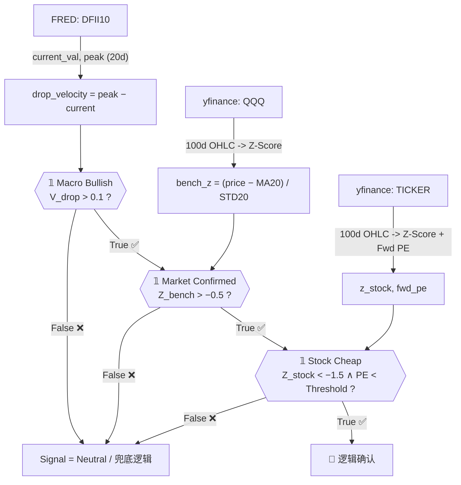

# QuantSystem S_v2.4 — 深度 Implementation Plan

> **系统版本**：S_v2.4 | Logic Confirmation Model | 2026-03-05  
> **主文件**：[app.py](file:///e:/%E9%87%8F%E5%8C%96%E7%AD%96%E7%95%A5v0.1/app.py)

---

## 一、逻辑拆解：三阶判定矩阵 (Logic Confirmation)

S_v2.4 的核心是一个严格的布尔串联门控结构。**三个条件必须同时为 True，才能触发 💎 信号，任一为 False 则全链路熔断。**



### 阶段详解

| 阶段 | 布尔变量 | 代码位置 | 判定条件 | 数据源 |
|------|---------|---------|---------|--------|
| **① 宏观门** | `macro_bullish` | [L69](file:///e:/%E9%87%8F%E5%8C%96%E7%AD%96%E7%95%A5v0.1/app.py#L69) | `drop_velocity > 0.1` | FRED DFII10 |
| **② 市场门** | `market_confirmed` | [L71](file:///e:/%E9%87%8F%E5%8C%96%E7%AD%96%E7%95%A5v0.1/app.py#L71) | `bench_z > -0.5` | QQQ 20日Z-Score |
| **③ 个股门** | `stock_cheap` | [L97](file:///e:/%E9%87%8F%E5%8C%96%E7%AD%96%E7%95%A5v0.1/app.py#L97) | `Z_stock < -1.5 ∧ PE < threshold` | Ticker + yfinance |

> [!IMPORTANT]
> `stock_cheap` 是唯一同时包含**技术面**（Z-Score）和**基本面**（Forward PE）的复合门。PE 阈值按股票类型差异化设定（TSM:20 / NVDA:45 / MSFT:32 / MU:15），防止高估值假信号。

---

## 二、变量追踪：宏观势能 0.18% 如何影响个股信号

以当前实际数据（`peak=1.94%, current=1.76%`）为例，完整追踪数据流：

```
FRED DFII10
    ├── recent_peak = max(tail 20d) = 1.94%      ← get_macro_data() L22
    └── current_val = iloc[-1]      = 1.76%      ← get_macro_data() L20

drop_velocity = 1.94 − 1.76 = 0.18%             ← get_trading_signal() L66

macro_bullish = (0.18 > 0.1) = True  ✅          ← L69  【宏观门：开启】
```

**此时宏观门开启，逻辑流向下游：**

```
QQQ Z-Score (bench_z)
    ├── bench_z > -0.5  →  market_confirmed = True/False
    │
    ├── 若 True  → 继续判定个股 Z-Score + PE
    └── 若 False → 所有个股维持 Neutral，不触发 💎

个股（以 TSM 为例）
    ├── z_stock < -1.5  AND  fwd_pe < 20
    │       True + True  → stock_cheap = True
    │
    └── macro_bullish(T) AND market_confirmed(T) AND stock_cheap(T)
            → signal = "💎 逻辑确认"
```

> [!NOTE]
> **势能 0.18% 的临界效应**：当 `drop_velocity` 在 `0.08%~0.12%` 区间徘徊时，宏观门处于「边界态」。建议未来版本引入 **势能平滑窗口（EMA平滑）** 防止噪音触发。

---

## 三、优化路线图：三个可扩展功能模块

### Module A：止盈逻辑引擎 (Take-Profit Engine) 🎯

**目标**：在触发 💎 信号后，自动追踪持仓盈亏，设置动态止盈线。

```python
# 建议新增函数
def get_take_profit_level(z_score: float, entry_price: float, symbol: str) -> dict:
    """
    基于 Z-Score 回归均值的目标价位计算。
    当 Z-Score 从 -1.5 回归至 +0.5 时，对应价格涨幅即为理论止盈空间。
    """
    revert_ratio = {
        "NVDA": 1.25,  # 高弹性，允许更大涨幅
        "MU":   1.30,  # 强周期，弹性最大
        "TSM":  1.15,  # 稳健型
        "MSFT": 1.10,  # 防御型
    }
    target = entry_price * revert_ratio.get(symbol, 1.15)
    stop_loss = entry_price * 0.92  # 固定 8% 止损
    return {"target": target, "stop_loss": stop_loss, "risk_reward": (target - entry_price) / (entry_price - stop_loss)}
```

**集成点**：在 `results.append()` 块中新增 `TP/SL` 列，仅对 `sig == "💎 逻辑确认"` 的标的计算。

---

### Module B：动态仓位管理 (Dynamic Position Sizing) 📊

**目标**：根据宏观势能强度 + 个股 Z-Score 深度，动态计算建仓比例，而非固定满仓。

$$\text{Position\%} = \text{BaseWeight} \times \underbrace{\min\left(\frac{V_{drop}}{0.3}, 1.0\right)}_{\text{宏观乘数}} \times \underbrace{\min\left(\frac{|Z_{stock}|}{3.0}, 1.0\right)}_{\text{超卖乘数}}$$

```python
def calc_position_size(drop_velocity: float, z_stock: float, base_weight: float = 0.10) -> float:
    macro_multiplier = min(drop_velocity / 0.3, 1.0)
    oversold_multiplier = min(abs(z_stock) / 3.0, 1.0)
    return round(base_weight * macro_multiplier * oversold_multiplier, 4)
```

**逻辑**：当势能仅 0.18%（临界值）时，仓位自动缩减为基础仓位的 60%；势能 0.30% 以上时才触发满仓。

---

### Module C：回测数据抽象层 (Backtesting Abstraction Layer) 🔬

**目标**：将当前实时逻辑与数据源解耦，使 Agent 可以注入历史数据进行向量化回测。

```python
# 将 get_trading_signal 改造为纯函数，无副作用
def evaluate_signal(
    symbol: str,
    z_score: float,
    fwd_pe: float | None,
    drop_velocity: float,   # 替代 macro_status dict
    bench_z: float,
    pe_thresholds: dict | None = None
) -> dict:
    """纯函数：给定标量输入，返回结构化信号结果。不依赖任何外部状态。"""
    pe_thresholds = pe_thresholds or {"TSM": 20, "NVDA": 45, "MSFT": 32, "MU": 15}
    macro_bullish   = bool(drop_velocity > 0.1)
    market_confirmed = bool(bench_z > -0.5)
    valid_pe = fwd_pe if fwd_pe is not None else float('inf')
    stock_cheap = (z_score < -1.5) and (valid_pe < pe_thresholds.get(symbol, float('inf')))
    
    triggered = macro_bullish and market_confirmed and stock_cheap
    return {
        "symbol": symbol,
        "signal": "💎 逻辑确认" if triggered else "Neutral",
        "macro_bullish": macro_bullish,
        "market_confirmed": market_confirmed,
        "stock_cheap": stock_cheap,
        "drop_velocity": drop_velocity,
        "z_score": z_score,
        "fwd_pe": fwd_pe,
    }
```

---

## 四、代码规范：面向 Agent 自动化回测的重构建议

> [!IMPORTANT]
> 以下规范使 Google Antigravity Agent 能够独立运行回测任务，无需人工干预。

### 4.1 目录结构重构

```
量化策略v0.1/
├── app.py                  # Streamlit UI 层（仅调用下层接口）
├── engine/
│   ├── __init__.py
│   ├── signals.py          # evaluate_signal() 纯函数
│   ├── data.py             # get_macro_data / get_zscore_data / get_fundamental_data
│   └── position.py         # calc_position_size / get_take_profit_level
├── backtest/
│   ├── runner.py           # 批量历史回测入口（Agent 调用此文件）
│   └── report.py           # 输出回测报告 CSV/HTML
└── tests/
    └── test_signals.py     # 单元测试（可被 Agent 自动运行）
```

### 4.2 Agent 可调用的回测入口规范

```python
# backtest/runner.py — Agent 通过此接口运行回测
def run_backtest(
    symbols: list[str],
    start_date: str,        # "2024-01-01" 格式
    end_date: str,
    pe_data_path: str,      # 历史 PE CSV 路径（避免实时 API 限速）
) -> pd.DataFrame:
    """
    Agent 调用示例：
    >>> results = run_backtest(["TSM","NVDA"], "2024-01-01", "2024-12-31", "data/pe.csv")
    >>> results.to_csv("backtest_results.csv")
    """
    ...
```

### 4.3 关键代码规范清单

| 规范项 | 当前状态 | 建议 |
|--------|---------|------|
| 纯函数隔离 | ❌ `get_trading_signal` 混合了数据解包和信号逻辑 | ✅ 拆分为 `evaluate_signal(scalars)` |
| 类型注解 | ❌ 无 | ✅ 全函数加 `float \| None` 注解 |
| 数据源抽象 | ❌ 直接调用 `yf.download` | ✅ 注入 `DataProvider` 接口，支持 mock |
| 单元测试 | ❌ 无 | ✅ 对所有边界条件写 `pytest` 断言 |
| 配置外部化 | ❌ PE 阈值硬编码 | ✅ 移至 `config.yaml` |

---

## 五、当前系统状态快照 (2026-03-05)

| 指标 | 数值 | 状态 |
|------|------|------|
| DFII10 当前值 | 1.76% | 📉 下行中 |
| DFII10 20日峰值 | 1.94% | — |
| **宏观势能 V_drop** | **0.18%** | **✅ 超越阈值 0.1%，宏观门开启** |
| QQQ bench_z | 待实时读取 | 决定市场门 |
| 💎 信号触发条件 | 宏观✅ + 市场? + 个股? | 2/3 已就绪 |
