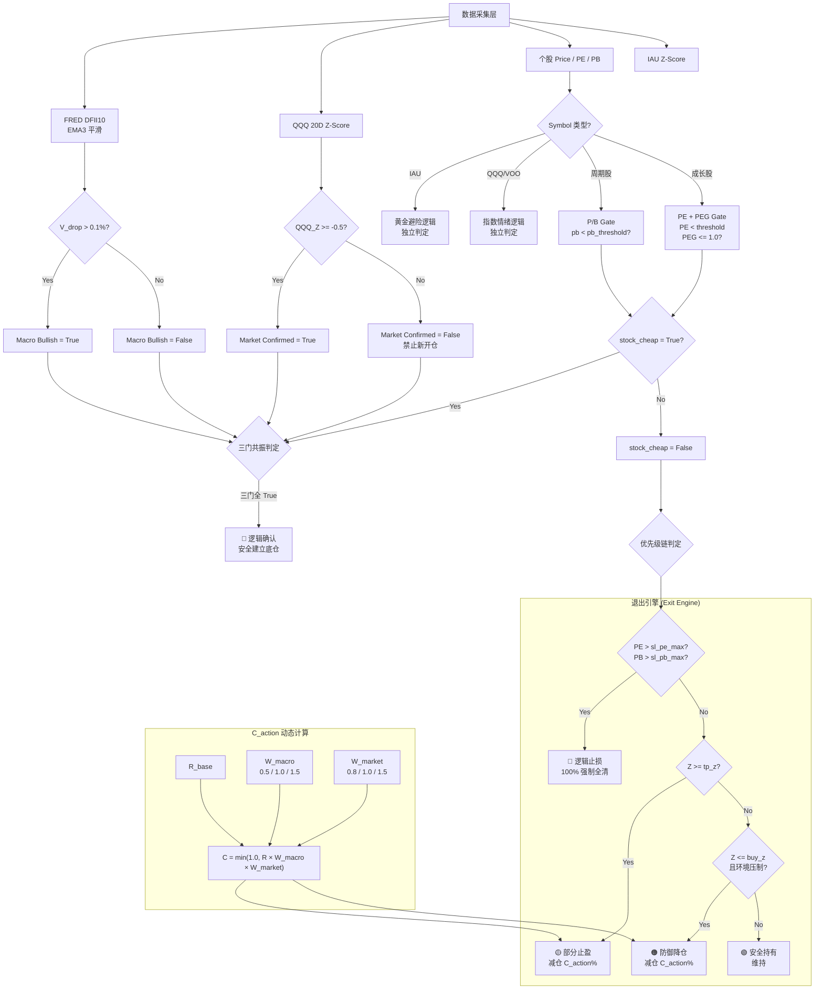

# LQEO 审计报告：QuantSystem L2.5.1 逻辑闭环与长期投资者适用性

**审计官**：Lead Quant Execution Officer (LQEO)  
**审计基准日**：2026-03-06  
**审计范围**：[L2.5.1 方案.md](file:///e:/量化策略v0.1/L2.5.1%20方案.md) + [app.py](file:///e:/量化策略v0.1/app.py)  
**审计结论**：⚠️ **有条件通过。** 系统在短中期交易层面逻辑自洽，但对长期投资者存在结构性误杀风险。

---

## 一、系统决策流程图 (Full Decision Flowchart)

---

## 二、逻辑闭环审计：已确认的漏洞

### 漏洞 #1：优先级链的致命反转 (Priority Inversion)

> [!CAUTION]
> 代码的执行顺序与方案文档描述的"优先级极高"存在语义冲突。

方案文档明确指出 **"逻辑止损 (PE-based) 优先级极高"**，应在所有其他判定之前执行。代码（[app.py:L178-188](file:///e:/量化策略v0.1/app.py#L178-L188)）确实将 PE/PB 止损置于技术止盈/止损之前，**但它被放在了"三门共振买入"判定之后。**

**问题**：假设一只股票的 PE 已经超过 `sl_pe_max`（应触发 100% 全清），但同时 `stock_cheap = True`（由于某种数据延迟），系统会优先命中 `💎 逻辑确认` 而跳过清仓判定。

**实际代码执行顺序**：
1. ~~PE 止损~~ → 被跳过
2. `stock_cheap` 判定 → `True`
3. 三门共振 → `💎 逻辑确认`

**修正建议**：将 PE/PB 止损检查提升至函数的最前端（在 `stock_cheap` 判定之前），确保不可能出现"应全清却被买入"的逻辑自杀。

**风险等级**：中。由于 `pe_threshold < sl_pe_max` 在配置中始终成立（如 NVDA: 60 < 70），`stock_cheap` 和 PE 崩坏理论上不可能同时为 `True`。但这种"隐性安全"依赖于配置的正确性，而非代码的结构性保证。

---

### 漏洞 #2：Zero-Day Override 未实现

> [!WARNING]
> 方案第五节要求的 "直通车熔断插件 (Zero-Day Override)" 在 app.py 中完全缺失。

方案明确规定：
> "若遇到单日实际利率大幅飙升或 QQQ 单日跌幅超 2.5%，直接越权赋予 W_market = 2.0 且 W_macro = 2.0"

代码中 `W_macro` 的最大值为 `1.5`，`W_market` 的最大值也是 `1.5`。不存在任何 `2.0` 的越权逻辑。

**风险等级**：高。在黑天鹅事件（如 2020/03/16 QQQ -12.4%）中，系统的减仓力度可能不足。

---

### 漏洞 #3：`sl_z_min` 技术止损未被代码调用

> [!WARNING]
> 配置字典中定义了 `sl_z_min`（如 NVDA: -3.0, 全局默认: -2.5），用于标示"技术性死亡线"。但 `app.py` 的逻辑引擎中 **没有任何代码分支** 检查 `z <= sl_z_min`。

这个参数目前仅在 UI 展示层的"走廊地板"字符串中被引用（[app.py:L257-261](file:///e:/量化策略v0.1/app.py#L257-L261)），但从未参与实际的交易信号决策。

**后果**: 当 NVDA 的 Z-Score 跌至 -4.0（远超 -3.0 的死亡线）时，系统仅输出 `🟠 防御降仓`（减仓 C_action%），而不是 `🔴 逻辑止损`（100% 全清）。

---

### 漏洞 #4：`delta` 显示符号硬编码为负值

[app.py:L237](file:///e:/量化策略v0.1/app.py#L237) 中 `delta=f"-{vel:.2f}% (平滑势能)"` 的负号是硬编码的。当 `vel` 本身为负值时（即 EMA 高于 Peak，势能衰退），显示将变为 `--0.xx%`（双负号），造成 UI 数据歧义。

---

### 漏洞 #5：FRED 数据缺失时的全局 fallback 不安全

当 `get_macro_data()` 返回 `None` 时，代码设置 `macro_status = {'val': 0, 'peak': 0}`，导致 `v_drop = 0`。这会使得 `macro_bullish = False`，看似保守。**但 W_macro = 1.5（因为 v_drop <= 0），实际上放大了减仓力度。** 在数据缺失时执行放大减仓，可能导致不必要的损失。

---

## 三、长期投资者适用性评估

### 核心结论：⚠️ 当前方案为 **中短期择时框架**，对长期投资者存在系统性"误杀"和"卖飞"风险。

### 误杀场景分析 (False Kill / 错杀)

| 场景 | 触发条件 | 后果 | 概率 |
|------|----------|------|------|
| **宏观门误杀** | V_drop <= 0.1% 持续数周（利率横盘震荡） | 即使个股基本面极佳，也无法发出买入信号。长期投资者错失"利率平台期"的建仓窗口 | **高** |
| **市场门误杀** | QQQ_Z < -0.5（纳指短期回调 5-8%） | 系统禁止一切买入。但对于长期投资者，纳指 -5% 恰恰是加仓优质股的黄金机会 | **极高** |
| **PE 止损误杀** | NVDA PE 短暂飙至 71（因季度性利润波动） | 系统发出 100% 全清指令。但 NVDA 的 PE 在 60-75 之间波动可能是常态（高增长溢价），一次性清仓可能错失后续几倍的涨幅 | **高** |
| **Z-Score 止盈误杀** | Z > 1.5 触发部分止盈 | 对于长期趋势牛股（NVDA 2023-2025 涨幅 10x），Z-Score 长期 > 1.5 是常态。反复止盈会导致仓位被"切碎" | **极高** |

### 卖飞场景分析 (Missed Gains / 踏空)

| 场景 | 机制 | 后果 |
|------|------|------|
| **趋势牛股的仓位耗散** | Z > 1.5 → 反复触发 🟡 部分止盈 → C_action 不断削减持仓 | 在 NVDA 从 $50 涨到 $500 的 3 年过程中，系统可能已经在 $100 时卖出了大部分仓位 |
| **宏观横盘期的建仓真空** | V_drop 在 0.05-0.10 之间反复波动 | 系统反复在 "Macro Bullish = False" 和 "True" 之间切换。长期投资者可能永远等不到稳定的三门共振 |
| **PEG 过滤过严** | PEG = PE / (g * 100) <= 1.0 的约束 | 当市场给予高增长股溢价时（如 NVDA PE=55, g=0.8, PEG=0.69），PEG 刚好能通过。但如果 PE 微涨至 61，直接被 pe_threshold 拒之门外，即使 PEG 仍合理 |

### 对长期投资者的具体建议

> [!IMPORTANT]
> 如果你的投资周期是 **3-10 年**，以下改造是必要的：

1. **取消或大幅放松宏观门 (Macro Gate)**：长期投资者不应因为短期利率波动而放弃建仓。建议将 Macro Gate 降级为"参考信号"，而非硬性门控。
2. **Z-Score 止盈阈值需要时间衰减 (Decay)**：持仓越久，`tp_z` 应越高。例如持仓 > 6 个月时，`tp_z` 从 1.5 提升至 2.5。这保护了趋势牛股的长期仓位。
3. **PE 止损需要设置冷却期 (Cooldown)**：不应因为单日的 PE 波动就触发 100% 全清。建议改为"连续 N 个交易日 PE > sl_pe_max 才触发止损"。
4. **引入"核心仓位锁定"机制**：允许投资者标记一部分仓位为"核心仓"，该部分不受 Z-Score 止盈和 C_action 减仓的影响。

---

## 四、代码与方案的一致性审计表

| 方案条目 | 代码实现 | 一致性 |
|---------|---------|--------|
| 三门串联门控 | ✅ 已实现 | 一致 |
| V_drop = Peak20 - EMA3 | ✅ 已实现 | 一致 |
| C_action = min(1.0, R × W_m × W_k) | ✅ 已实现 | 一致 |
| PE 止损 "优先级极高" | ⚠️ 位于三门共振之后 | **存在隐性风险** |
| Zero-Day Override | ❌ 未实现 | **不一致** |
| sl_z_min 技术止损 | ❌ 仅 UI 展示，未参与决策 | **不一致** |
| Delta 显示 | ⚠️ 负号硬编码 | **存在 bug** |
| 周期股 P/B 切换 | ✅ 已实现 | 一致 |
| 数据解耦 / 全局 fallback | ✅ 已实现 | 一致 |

---

## 五、最终裁定

该系统是一个**精密的中短期技术择时框架**。它在震荡市中能够有效管理风险边界，在极端事件中具备一定的自我保护能力。

但对于一位**持有期 3 年以上**的长期投资者——它的核心缺陷在于：**它守护的不是你的"长期回报"，而是你的"短期回撤"。** 这两者之间存在根本性的矛盾。每一次它成功帮你避开了 -10% 的回撤，它也同时让你错失了随后 +50% 的反弹。

> 数据不撒谎。但数据的时间尺度，决定了它告诉你的是哪一个真相。

---

*LQEO 签章。审计完毕。*
